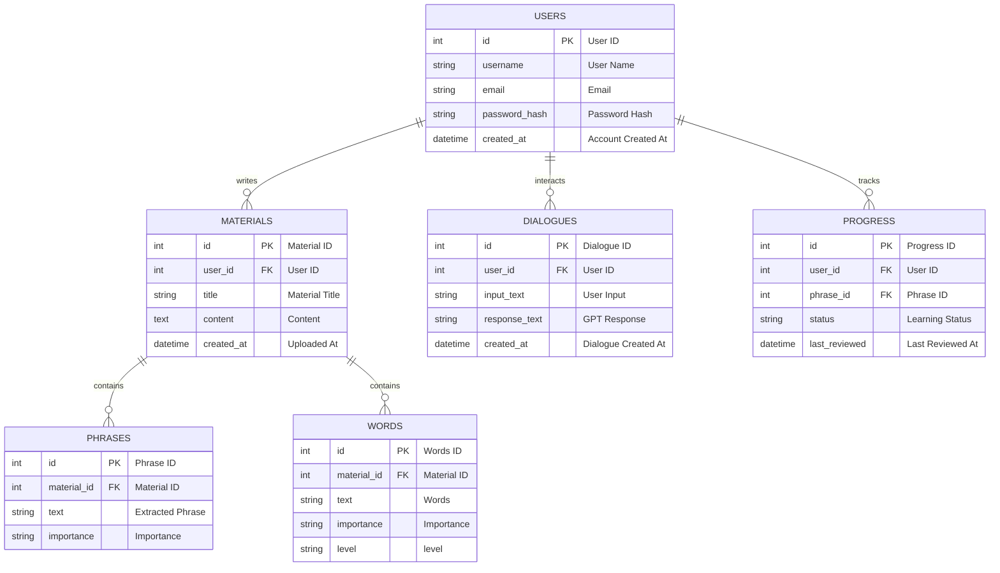

```mermaid
erDiagram
USERS ||--o{ MATERIALS : writes
USERS ||--o{ DIALOGUES : interacts
USERS ||--o{ PROGRESS : tracks
MATERIALS ||--o{ PHRASES : contains
MATERIALS ||--o{ WORDS : contains
USERS {
int id PK "User ID"
string username "User Name"
string email "Email"
string password_hash "Password Hash"
datetime created_at "Account Created At"
}
MATERIALS {
int id PK "Material ID"
int user_id FK "User ID"
string title "Material Title"
text content "Content"
datetime created_at "Uploaded At"
}
PHRASES {
int id PK "Phrase ID"
int material_id FK "Material ID"
string text "Extracted Phrase"
string importance "Importance"
}
WORDS {
int id PK "Words ID"
int material_id FK "Material ID"
string text "Words"
string importance "Importance"
string level "level"
}
DIALOGUES {
int id PK "Dialogue ID"
int user_id FK "User ID"
string input_text "User Input"
string response_text "GPT Response"
datetime created_at "Dialogue Created At"
}
PROGRESS {
int id PK "Progress ID"
int user_id FK "User ID"
int phrase_id FK "Phrase ID"
string status "Learning Status"
datetime last_reviewed "Last Reviewed At"
}
```
